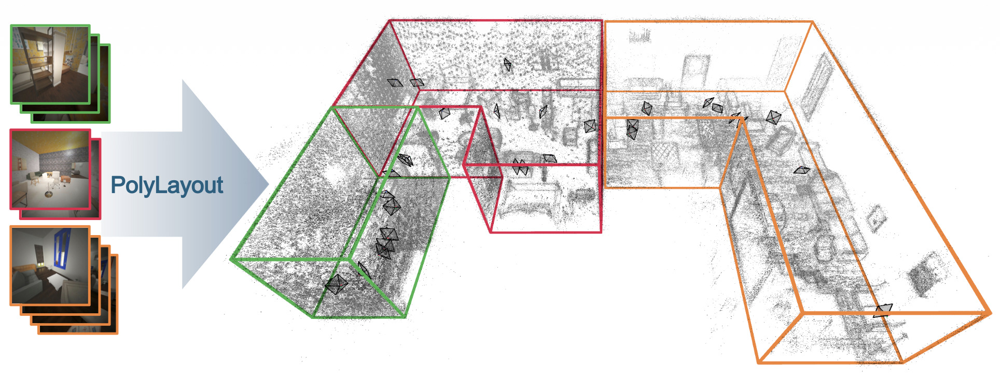

# PolyLayout



PyTorch implementation and pre-trained weights for the paper **PolyLayout: Multi-room Manhattan Layout Estimation** (ECCV 2026).

PolyLayout is a multi-view multi-room layout estimation method. Given posed perspective images it jointly estimates the layout of multiple rooms.

Project page: https://ghanning.github.io/PolyLayout/

## Code base

PolyLayout is built upon the excellent [PixLoc](https://github.com/cvg/pixloc) code base. The PixLoc `master` branch is available in this repository under the name `pixloc`.

## Installation

Install PolyLayout in editable mode as follows:

```bash
git clone https://github.com/ghanning/PolyLayout.git
cd PolyLayout/
virtualenv venv
source venv/bin/activate
pip install -e .
```

Running the demo notebook requires some extra dependencies that can be installed with:

```bash
pip install -e .[extra]
```

## Datasets

Download the [Aria Synthetic Environments](https://www.projectaria.com/datasets/ase/), [ScanNet++](https://kaldir.vc.in.tum.de/scannetpp/) and [2D-3D-Semantics](https://github.com/alexsax/2D-3D-Semantics) datasets from their respective web sites and unpack into a subdirectory named "datasets". The expected directory structure is shown below.

```
.
└── datasets
    ├── 2d3ds
    │   ├── area_1
    │   ├── area_2
    │   ├── area_3
    │   ├── area_4
    │   ├── area_5a
    │   ├── area_5b
    │   └── area_6
    ├── ase
    │   ├── 10698
    │   ├── 11336
    │   ├── 12462
    .   .
    └── scannetpp
        ├── data
        ├── metadata
        └── splits
```

**Note**: Only ScanNet++ is used to train PolyLayout, but we provide code to run the room layout estimation also on Aria Synthetic Environments and 2D-3D-Semantics.

## Image undistortion

The PolyLayout code currently supports only pinhole cameras. Follow the steps below to undistort the images in each dataset.

### Aria Synthetic Environments

Undistort the fisheye images as explained [here](https://github.com/ghanning/MultiViewRoomLayout?tab=readme-ov-file#image-undistortion-aria-synthetic-environments).

### ScanNet++

~Use the [ScanNet++ Toolbox](https://github.com/scannetpp/scannetpp) to undistort the DSLR fisheye images by following the instructions [here](https://github.com/scannetpp/scannetpp?tab=readme-ov-file#undistortion-convert-fisheye-images-to-pinhole-with-opencv).~

**Note**: As of April 30, 2025, undistorted DSLR images are included in the ScanNet++ dataset and this step can thus be skipped.

### 2D-3D-Semantics

Split the panorama images into perspective views as detailed [here](https://github.com/ghanning/MultiViewRoomLayout?tab=readme-ov-file#perspective-images-2d-3d-semantics).

## Preprocessing for training on ScanNet++

### Depth maps

Render depth maps for the undistorted DSLR images using the `render-undistorted` branch in [my fork](https://github.com/ghanning/scannetpp) of the ScanNet++ Toolbox as described [here](https://github.com/scannetpp/scannetpp?tab=readme-ov-file#render-depth-for-dslr-and-iphone), but set `render_undistorted` to `True`.

### 2D-3D correspondences

Run our preprocessing script to find the 2D-3D point correspondences used in training:

```bash
python -m pixloc.pixlib.preprocess_scannetpp
```

## Line segments (optional)

While line segments are not required to train PolyLayout they improve its performance at inference time. To extract line segments with [DeepLSD](https://github.com/cvg/DeepLSD) first install it with

```bash
pip install -e .[deeplsd]
```

then download the pre-trained weights

```bash
mkdir weights
wget https://cvg-data.inf.ethz.ch/DeepLSD/deeplsd_md.tar -O weights/deeplsd_md.tar
```

and run the extraction for Aria Synthetic Environments, ScanNet++ and 2D-3D-Semantics:

```bash
./scripts/line_segments_ase.sh
./scripts/line_segments_scannetpp.sh
./scripts/line_segments_2d3ds.sh
```

Alternatively, you can download the extracted line segments for [ASE](https://drive.google.com/file/d/1Oe4JH0vPWB42k9D8jYah44PwXGpAExRC/view?usp=share_link) (27 MiB), [ScanNet++](https://drive.google.com/file/d/1_l1sA8RgZ-REx9tRP8UpgQMCkRaSdmz1/view?usp=share_link) (777 MiB) and [2D-3D-Semantics](https://drive.google.com/file/d/1mP744R2uNAnHNpKCMosrd6tNCxOTW2dt/view?usp=sharing) (8 MiB) and unpack them with the command

```bash
unzip line_segments_ase.zip -d datasets/ase
unzip line_segments_scannetpp.zip -d datasets/scannetpp
unzip line_segments_2d3ds.zip -d datasets/2d3ds
```

## Training

Training is done in three stages. First the edge detector is pre-trained by running:

```bash
python -m pixloc.pixlib.train --conf pixloc/pixlib/configs/pretrain_polylayout_scannetpp.yaml polylayout_scannetpp_pretrain
```

Next the full network is trained, with weights initialized from the previous stage:

```bash
python -m pixloc.pixlib.train --conf pixloc/pixlib/configs/train_polylayout_scannetpp.yaml polylayout_scannetpp train.load_experiment=polylayout_scannetpp_pretrain
```

Finally we fine tune the model with a lower learning rate:
```bash
python -m pixloc.pixlib.train --conf pixloc/pixlib/configs/train_polylayout_scannetpp.yaml polylayout_scannetpp_fine_tuned train.load_experiment=polylayout_scannetpp train.lr=0.66e-07 train.epochs=5
```

*Tip*: Pass the `--wandb_project <PROJECT>` argument to the training script to log the results to [Weights & Biases](https://wandb.ai).

## Evaluation

We supply a script to run PolyLayout and output the room layout predictions to a JSON file.

### Aria Synthetic Environments

```bash
python -m pixloc.run_PolyLayout --experiment polylayout_scannetpp_fine_tuned --conf pixloc/pixlib/configs/eval_polylayout_ase.yaml --split {val,test} --output OUTPUT
```

### ScanNet++

```bash
python -m pixloc.run_PolyLayout --experiment polylayout_scannetpp_fine_tuned --conf pixloc/pixlib/configs/eval_polylayout_scannetpp.yaml --split multi_room --output OUTPUT
```

### 2D-3D-Semantics

```bash
python -m pixloc.run_PolyLayout --experiment polylayout_scannetpp_fine_tuned --conf pixloc/pixlib/configs/eval_polylayout_2d3ds.yaml --split test --output OUTPUT
```

The resulting predictions can be evaluated using the code in the [MultiViewRoomLayout](https://github.com/ghanning/MultiViewRoomLayout) repository.

## Pre-trained weights

Pre-trained weights for a model trained on ScanNet++ as outlined above can be found [here](https://drive.google.com/file/d/1rfrVKP9vVkcl0oyfdP0-AdNDqnH6yEU1/view?usp=sharing) (298 MiB). Extract the checkpoint with

```bash
mkdir -p outputs/training && unzip polylayout_scannetpp_fine_tuned.zip -d outputs/training
```

## Demo

Try out PolyLayout on Aria Synthetic Environments and ScanNet++ with the Jupyter notebook [demo_PolyLayout.ipynb](notebooks/demo_PolyLayout.ipynb).

## BibTeX citation

Use the BibTeX reference below to cite our work.

```
@inproceedings{hanning2026polylayout,
  title={{PolyLayout: Multi-room Manhattan Layout Estimation}},
  author={Hanning, Gustav and Liu, Shaohui and Pautrat, Rémi and Pollefeys, Marc and Åström, Kalle and Larsson, Viktor},
  booktitle={European Conference on Computer Vision},
  year={2026},
}
```

In addition, please consider citing the PixLoc paper:

```
@inproceedings{sarlin21pixloc,
  title={{Back to the Feature: Learning Robust Camera Localization from Pixels to Pose}},
  author={Paul-Edouard Sarlin and Ajaykumar Unagar and Måns Larsson and Hugo Germain and Carl Toft and Viktor Larsson and Marc Pollefeys and Vincent Lepetit and Lars Hammarstrand and Fredrik Kahl and Torsten Sattler},
  booktitle={CVPR},
  year={2021},
}
```
